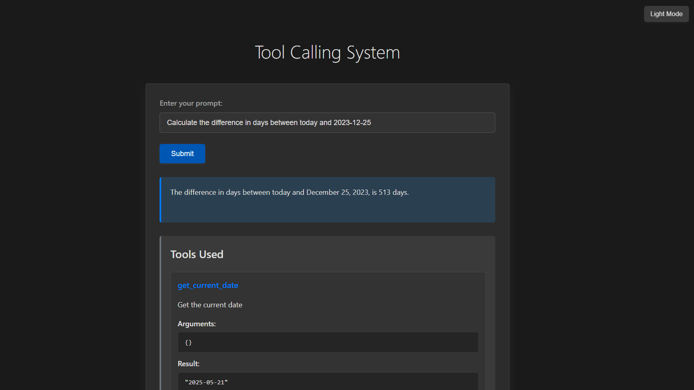

# 🚀 The IBM Granite Agent: Your Smart Tool-Using LLM Companion! 🤖

**Welcome to a Capstone Adventure in AI!**

This isn't just another chatbot. This project unveils an **intelligent agent** powered by the formidable **IBM Granite series Large Language Model (LLM)**, all running locally on your machine thanks to Ollama. Witness firsthand how this LLM transcends basic Q&A, acting as a sophisticated agent that understands your needs, reasons about solutions, and dynamically utilizes a suite of tools to get the job done! 🛠️

Whether it's complex date calculations, tricky math problems, or nuanced text analysis, our Granite-powered agent intelligently calls upon specialized tools, extending its capabilities far beyond its inherent knowledge. All interactions and data processing happen on your device, ensuring privacy and control. Explore the future of interactive AI through our sleek web interface (now with Dark Mode! 🌙) or our trusty command-line companion.

## The Agentic Powerhouse: Core Objective & Significance 🧠✨

This capstone project is all about showcasing the **agentic capabilities** of modern LLMs like IBM Granite. We're diving deep into how these models can:

-   🔍 **Understand & Decompose**: Brilliantly parse your complex requests in natural language.
-   🤔 **Reason & Plan**: Strategically determine the best tools and steps needed to fulfill your query.
-   📞 **Act & Execute**: Dynamically call external functions (our tools!) with precisely formulated arguments.
-   📝 **Synthesize & Respond**: Intelligently process tool outputs to generate coherent, human-like, and accurate answers.

This project demonstrates a pivotal shift in AI – from passive text generators to **proactive, problem-solving agents** that can interact with and leverage external systems. It's a glimpse into a more capable and versatile AI-powered future!

## Project Structure

```
├── toolCalling.py      # Main CLI application
├── web_app.py          # Web interface
├── config.py           # Configuration settings
├── requirements.txt    # Dependencies
├── log.md              # Log file
├── README.md           # Documentation
└── tools/              # Tool implementations
    ├── base.py         # Base tool class
    ├── date_tools.py   # Date calculation tools
    ├── math_tools.py   # Mathematical tools
    └── text_tools.py   # Text processing tools
```

## ✨ Key Features: What Makes This Agent Shine! ✨

-   🤖 **True Agentic Workflow**: Witness the IBM Granite LLM acting as an intelligent agent, making decisions and orchestrating tool use.
-   🛠️ **Dynamic Function Calling**: See the LLM's prowess in formulating precise requests for external tools and understanding their structured (JSON) responses.
-   🗣️ **Superior NLU & Synthesis**: Marvel at how the LLM interprets diverse inputs and crafts natural, human-like explanations from raw tool data.
-   🧩 **Expandable Tool Arsenal**: A modular design means new tools can be easily integrated, constantly boosting the agent's skills!
-   💻 **Dual Interaction Modes**: Choose your adventure! Engage via a polished, modern web UI (complete with a cool dark mode!) or a robust command-line interface.
-   🔍 **Transparent Insights**: The web UI peels back the curtain, showing exactly which tools were used, with what arguments, and their results – a fantastic way to see the agent's "thinking" process!
-   🔒 **Local & Private**: Powered by Ollama, the entire system, including the LLM, runs locally on your machine. This means your data stays private, and you have full control over the environment.
-   📝 **Detailed Logging**: Every step, every tool call, every result meticulously logged for easy debugging and deeper understanding.

## Tools

### Date Tools

- **DateCalculator**: Calculates dates by adding or subtracting days, months, or years from a given date.
- **DateDifference**: Calculates the difference in days between two dates.
- **GetCurrentDate**: Retrieves the current date in YYYY-MM-DD format.
- **GetCurrentTime**: Retrieves the current time in HH:MM:SS format.
- **GetCurrentDayName**: Retrieves the name of the current day (e.g., Monday).

### Math Tools

- **ExpressionEvaluator**: Evaluates mathematical expressions with support for various math functions.

### Text Tools

- **TextCounter**: Counts the number of words in a given text.
- **TextAnalyzer**: Analyzes text properties including character count, word count, sentence count, and average word length.
- **TextFormatter**: Formats text with operations like uppercase, lowercase, title case, etc.
- **SpecificLetterCounter**: Counts the occurrences of a specific letter or substring within a given text (e.g., "how many 'a's in 'banana'").

## Installation

1. **Clone the repository**:
   ```sh
   git clone https://github.com/daruoktab/ollama.git
   cd tool-calling-system
   ```

2. **Install Ollama**:
   This project requires Ollama to be installed and running to serve the language model locally on your machine.
   *   Download Ollama from the official website: [https://ollama.com/download](https://ollama.com/download)
   *   Follow the installation instructions for your operating system (Windows, macOS, or Linux).
   *   Ensure the Ollama application is running before proceeding.

3. **Pull the Required Model**:
   Once Ollama is running, open your terminal or command prompt and pull the IBM Granite model used by this project:
   ```sh
   ollama pull granite3.3
   ```
   (This model `granite3.3` is set as the `DEFAULT_MODEL` in `config.py`.)

4. **Install Python dependencies**:
   ```sh
   pip install -r requirements.txt
   ```

## Usage

### Command Line Interface

1. **Run the main script**:
   ```sh
   python toolCalling.py
   ```

2. **Enter your prompt**:
   - For date calculations:
     - "What date will it be X days/months/years from today?"
     - "What date was X days/months/years ago?"
     - "Days between date1 and date2"
     - "What is the current date?"
     - "What time is it?"
     - "What day of the week is it?"
   - For math calculations:
     - "What is 2 + 2?"
     - "Calculate 15% of 200"
     - "What is the square root of 144?"
   - For text processing:
     - "Count the words in this text."
     - "Analyze this paragraph for me."
     - "Convert this text to uppercase."
     - "How many times does 'the' appear in 'the quick brown fox jumps over the lazy dog'?"

3. **View the results**:
   The system will determine the appropriate tool to use, display the result, and show which tools were used.

### Web Interface

1. **Start the web server**:
   ```sh
   python web_app.py
   ```

2. **Open your browser**:
   Navigate to `http://localhost:12000` (or the port specified in your environment)

3. **Enter prompts and view results**:
   The web interface will show both the response and which tools were used to generate it.

## Configuration

Edit `config.py` to customize:
- Default LLM model
- Logging settings
- Enabled tools

## Logging

Logs are written to `log.md` in a markdown-friendly format. This includes tool arguments, execution results, and any errors encountered.

## Requirements

- Python 3.8+
- ollama library
- flask (for web interface)
- pydantic

Install all dependencies with:
```
pip install -r requirements.txt
```
## Future Enhancements
-   **Tool Expansion**: Add more tools for diverse functionalities (e.g., web scraping, file manipulation).
- **image support**: Integrate image processing tools for OCR, image analysis, etc.
- **multi-turn conversations**: Enhance the agent's ability to maintain context over multiple interactions.

## Capstone Project Significance

This project serves as a practical demonstration of leveraging advanced LLM capabilities for building intelligent, tool-augmented applications. The use of IBM Granite for sophisticated tool orchestration and natural language interaction highlights the potential for creating more powerful and versatile AI systems.
